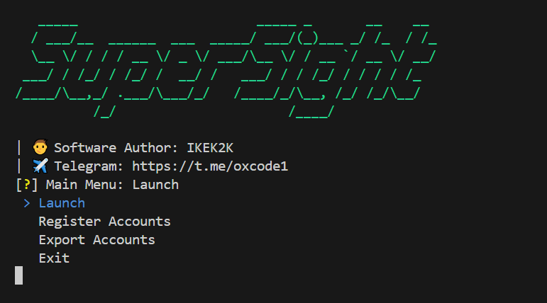

# SuperSight
[](https://t.me/oxcode1)



## 💡Функционал  
| Функционал                                                     | Поддерживается  |
|----------------------------------------------------------------|:---------------:|
| Многопоточность                                                |        ✅       |
| Генерация аккаунтов SuperSight с почтой MailTM                 |        ✅       |
| Привязка Twitter                                               |        ✅       |
| Генерация кошелька EVM (чуть позже пригодится)                 |        ✅       |
| Daily Log-in                                                   |        ✅       |
| Analyzer случайных token / wallet                              |        ✅       |
| Экспорт аккаунтов из БД в txt, excel                           |        ✅       |

## [⚙️Настройки](https://github.com/NikeAK/SuperSight/blob/main/data/config.py)
| Настройка             | Описание                                                        |
|-----------------------|-----------------------------------------------------------------|
| **REFERRAL_CODE**     | Реферальный код из ссылки                                       |
| **BIND_TWITTER**      | Привязка Twitter - True/False                                   |
| **DELAY_ANALYZER**    | Интервал зарежки [min, max] между запросами для Analyzer        |
| **LOGGER_PROXY**      | Вывод информацию о статусе прокси - True/False                  |
| **EXPORT_DATA**       | Используемые данные для экспорта. Записываются через запятую!   |
| **EXPORT_SEPARATOR**  | Символ для разделения данных TXT                                |

**Краткий принцип работы:**
1. При выборе "Launch", софт берёт аккаунты из БД, проверяет прокси, входит в аккаунт, пользуется analyzer поиском, записывает в бд актуальное значение crystal.
2. При выборе "Register accounts", софт берет 1 токен и 1 прокси, проверяет прокси, создает почту, проходит регистрацию supersight, забирает бонусы, привязывает твиттер к аккаунту, создает новый приватный ключ evm, сохраняет аккаунт в БД.
3. При выборе "Export", софт предлагает выбрать в каком формате (txt, excel) экспортировать, далее экспортирует данные которые вы указали в config.py.

Если BIND_TWITTER = False, то софт будет работать, пока не закончатся прокси (Реферал без твиттера не засчитывается)

$\color{#58A6FF}\textsf{\Large\&#x24D8;\kern{0.2cm}\normalsize Note}$
**Перед началом работы, заполните $\color{yellow}{\textsf{twitter-token.txt}}$ и $\color{yellow}{\textsf{proxy.txt}}$! Загружайте прокси побольше**

## ⚡️Быстрый запуск
1. Запустите $\color{orange}{\textsf{Setup.bat}}$. Этот скрипт автоматически создаст виртуальное окружение, активирует его, установит все необходимые зависимости из файла requirements.txt и удалит не нужные файлы.
2. После успешного выполнения $\color{orange}{\textsf{Setup.bat}}$, вы можете запустить $\color{orange}{\textsf{Main.bat}}$. Этот скрипт также активирует виртуальное окружение и запустит софт.

## 🛠️Ручная установка
```shell
~ >>> python -m venv Venv              #Создание виртуального окружения
~ >>> Venv/Scripts/activate            #Активация виртуального окружения
~ >>> pip install -r requirements.txt  #Установка зависимостей
~ >>> python main.py                   #Запуск
```

## 💰DONATION EVM ADDRESS: 
**0x1C6E533DCb9C65BD176D36EA1671F7463Ce8C843**
